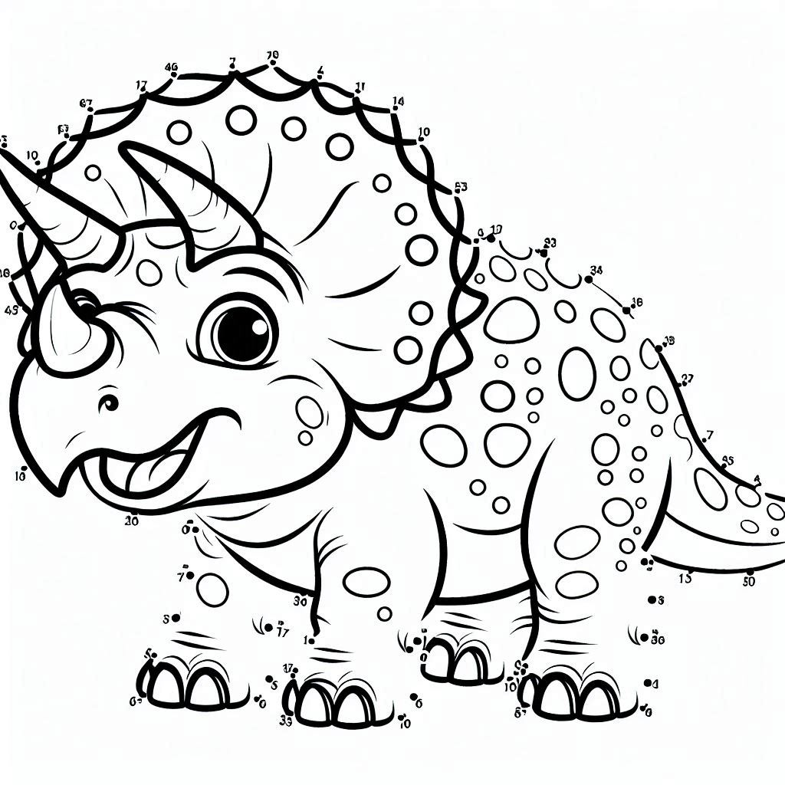

# 🪄 AI Connect-the-Dots Generator 🔢

Step into the realm of dotted delights! This Streamlit app is your enchanted portal to crafting charming connect-the-dots puzzles that will captivate youngsters (and let's face it, grown-ups too) with pure joy!

## 🌟 What's This All About?
    

Imagine conjuring a parade of delightful dot puzzles with a wave of your digital wand! That's exactly what you can do here! Our app harnesses the magic of AI to whip up custom connect-the-dots pages quicker than you can sharpen your favorite pencil!

## 🚀 Features

- 🖋️ Conjure one-of-a-kind dot puzzles across various motifs
- 🖼️ Choose how many masterpieces you want to connect (up to 10!)
- 💾 Save your dot-tastic creations in a neat zip package
- 🌞 Ideal for lazy Sundays, festive gatherings, or whenever you crave a sprinkle of dot-driven delight

## 🏃‍♂️ Getting Started
### Prerequisites

- Python 3.8+
- Streamlit
- OpenAI API key (see below for instructions)

## 🏃‍♂️ How to Run

### Option 1: Use Our Streamlit Page (No Code Required!)

1. Visit our Streamlit page at [[AI Connect-the-Dots Generator](https://connect-the-dots-generator.streamlit.app/)]
2. Get ready to generate some adorable connect-the-dots pages!

### Option 2: Run It Yourself

1. Clone this repo faster than you can connect two dots
2. Install the requirements (it's like joining the dots of your virtual environment)
3. Run `streamlit run app.py` and watch the dotty magic happen!

## 🔑 Getting Your OpenAI API Key

Before you can start generating cute images, you'll need an OpenAI API key. Here's how to get one:

1. Visit [OpenAI's website](https://platform.openai.com/)
2. Sign up or log in: If you don't have an account, click "Sign up" and create one. If you already have an account, click "Log in".
3. Navigate to API keys: Once logged in, look for your account name or icon in the top-right corner of the page. Click on it to open a dropdown menu.
4. Select "Your Profile".
5. Select "User API keys".
6. Create a new API key: Look for a button that says "Create new secret key" or "+ New secret key".
7. Name your key (optional): You may have the option to give your API key a name.
8. Copy and save your API key: After creating the key, you'll see it displayed once. **Make sure to copy it immediately and store it securely, as you won't be able to see it again.**
9. Set up billing: Before you can use your API key, you need to set up billing. Look for a "Billing" or "Payment" section in the account settings or main menu.
10. Set usage limits (optional): In the billing section, you may be able to set usage limits to control your spending.

## 🎨 Using Your API Key on Streamlit

1. When you open our Streamlit app, you'll see a text box asking for your API key
2. Paste your API key into this box (don't worry, we won't peek!)
3. Click "Enter" and voila! You're ready to generate some cuteness!

## 🎨 A Parade of Themes

From "Circus Dots Under the Big Top" to "Space Explorers Connecting Stars," our themes are as boundless as your fantasies! Can't spot your dream theme? Let our AI surprise you with an even more spectacular dot-venture!

## ⚠️ Fair Warning

Potential side effects may include:
- An irresistible itch to link every dot in sight
- Newfound appreciation for the art of dot-connecting
- Temptation to showcase your AI-crafted dot masterpieces

## 👏 Tip of the Hat

Our heartfelt thanks go out to:
- The clever AI behind these dotted delights
- Sharp pencils and patient erasers worldwide
- You, the dot-connecting virtuoso, bringing these creations to life!

In a universe of infinite possibilities, choose to be dot-tally amazing! Enjoy your dot-to-dot journey! 📍✨

## 🚧 Work in Progress

Please note that this project is still a work in progress. Currently, the dots in the generated images are not sequenced properly. We're working on improving this feature to make your connect-the-dots experience even more enjoyable!
